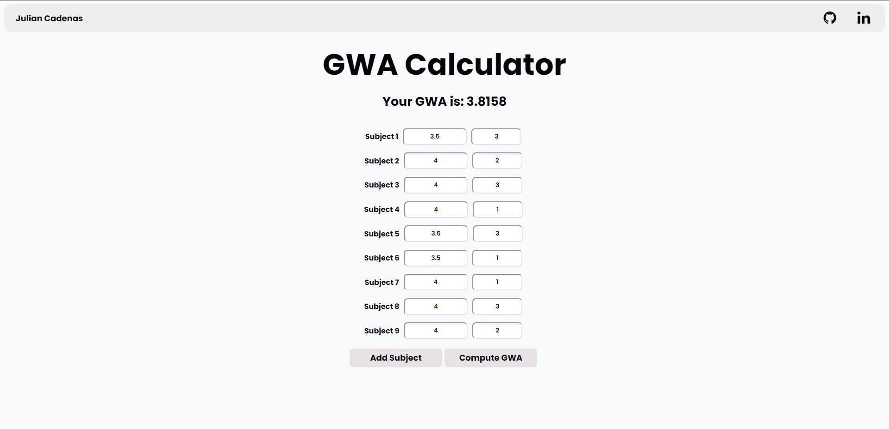
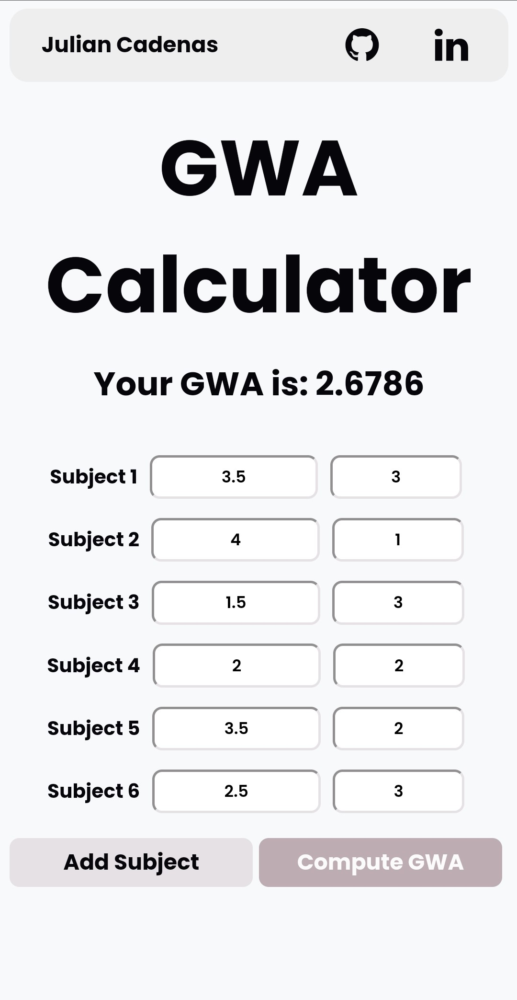

# GWA Calculator

The GWA Calculator is a simple web application designed to help students compute their General Weighted Average (GWA) quickly and efficiently. This project provides an interface where users can input their grades and the corresponding units for each subject, and then calculate their GWA.

The GWA Calculator project is developed with HTML, CSS, and JavaScript, while jQuery is used to enable the website to append/insert new elements within the application. These technologies collectively enable the creation of the GWA Calculator.

## Screenshots

